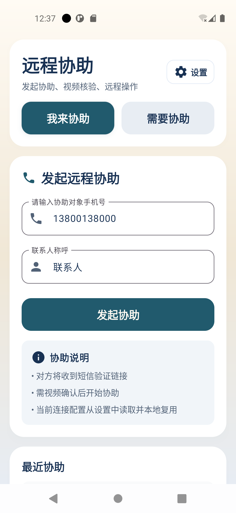
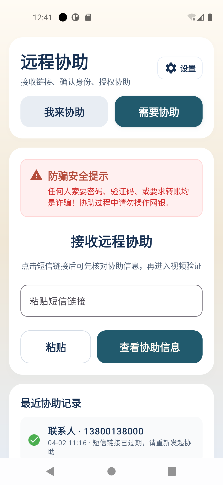

# RemoteHelp

RemoteHelp 是一个面向家庭远程协助场景的 Android + Node.js 项目，当前仓库包含：

- 统一的 Android 主应用 `clients/android/mainproject`
- 用于联调的 Node.js 信令服务 `server/`

## 应用截图





## 文档入口

- [使用文档（含协助方/被协助方操作说明）](./docs/user-guide.md)
- [技术文档](./docs/technical-guide.md)
- [主应用落地说明](./clients/android/mainproject/IMPLEMENTATION.md)
- [服务端说明](./server/README.md)

## 项目结构

- `server/`：Express + WebSocket 联调服务，提供健康检查、配置下发和房间信令转发
- `clients/android/mainproject/`：统一主应用，包含邀请、验证、会话和远程协助流程
- `docs/`：项目说明文档

## 配置说明

### 服务端配置

服务端环境变量（主要项）：

```env
PORT=3000
HOST=127.0.0.1
NODE_ENV=development

TOKEN_SECRET=
TOKEN_SECRET_FILE=.token_secret
MIN_TOKEN_SECRET_LENGTH=32

ENFORCE_INVITE_API_KEY=true
INVITE_API_KEY=
INVITE_API_KEY_FILE=.invite_api_key

INVITE_RATE_LIMIT_WINDOW_MS=60000
INVITE_RATE_LIMIT_MAX_REQUESTS=30

WS_ALLOWED_ORIGINS=https://help.yourdomain.com
WS_ALLOWED_HOSTS=
WS_REQUIRE_ORIGIN=false
```

说明：

- `TOKEN_SECRET` 用于签名验证令牌，生产环境必须配置强密钥（或有效 `TOKEN_SECRET_FILE`）。
- `INVITE_API_KEY` 用于保护邀请接口，默认开启校验。
- 若未手动设置 `INVITE_API_KEY`，服务首次启动会在 `INVITE_API_KEY_FILE` 自动生成并持久化 key。
- 默认监听 `127.0.0.1`，若需局域网联调请显式设置 `HOST=0.0.0.0`。

### 客户端配置

客户端主要在应用内“设置”页面配置，关键项如下：

- 信令服务地址
- 邀请接口 API Key
- 默认协助方姓名
- STUN / TURN 服务地址
- TURN 用户名与密码

推荐值：

- 生产：`wss://<你的域名>/ws`
- 模拟器联调：`ws://10.0.2.2:3000/ws`（仅 Debug）
- 真机联调：`ws://<宿主机局域网IP>:3000/ws`（仅 Debug）

## 使用说明

### 服务端使用

1. 安装依赖并启动

```bash
cd server
npm install
npm run dev
```

默认监听：

- `http://127.0.0.1:3000`
- `ws://127.0.0.1:3000/ws`

2. 健康检查

```text
GET /health
GET /config
```

### 客户端使用

使用 Android Studio 打开 `clients/android/mainproject`，直接运行 `mainproject` 模块。

首次运行建议：

- 完成相机、麦克风、通知、悬浮窗、无障碍、屏幕采集等权限授权。
- 进入设置页填写服务地址与邀请接口 API Key（来自服务端 `INVITE_API_KEY` 或 `server/.invite_api_key`）。

调试时常用信令地址：

- 模拟器：`ws://10.0.2.2:3000/ws`
- 真机：`ws://<宿主机局域网IP>:3000/ws`

主流程：

1. 协助方创建请求
2. 被协助方打开链接并进入核验
3. 双方视频核验通过
4. 进入远程协助与屏幕控制

## 当前能力

- 生成一次性协助请求
- 支持 Deep Link 拉起流程
- 通过 WebRTC 完成音视频验证
- 进入远程协助控制台
- 支持屏幕采集和无障碍远程操作
- 保留本地会话和日志能力的基础框架

## 说明

- `help.yourdomain.com` 是当前 Deep Link 的示例域名，部署时需要替换成真实域名。
- 当前服务端以内存房间为主，适合本地联调和 MVP 验证，不适合作为生产持久化实现。
